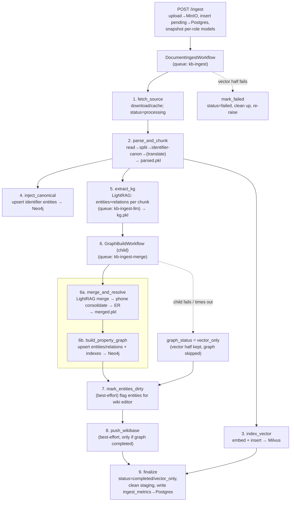
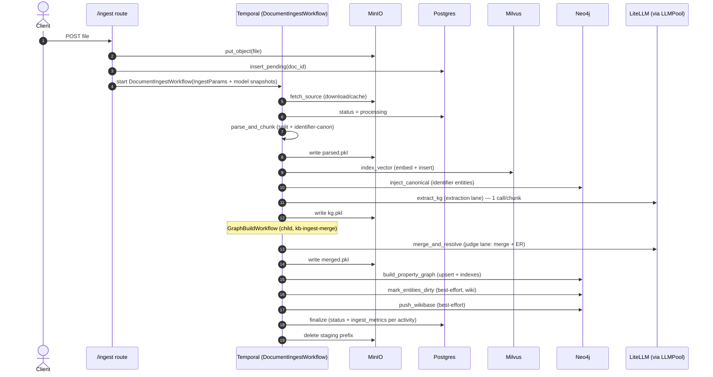

# Ingest pipeline

How a document becomes searchable: the Temporal-orchestrated ingest flow, the blocks that run, the queues they run on, and how heavy state is passed between them.

> Diagrams: Mermaid (below, edit-as-text) + a rendered D2 overview at [`diagrams/ingest_flow.svg`](diagrams/ingest_flow.svg) (source [`diagrams/ingest_flow.d2`](diagrams/ingest_flow.d2)).
> Queues reference: [`QUEUES.md`](QUEUES.md). Top-level architecture: [`ARCHITECTURE.md`](ARCHITECTURE.md).

## TL;DR

`POST /ingest` uploads the file to **MinIO**, records a pending row in **Postgres**, snapshots the per-role model names, and starts the durable **`DocumentIngestWorkflow`** on the `kb-ingest` queue. The workflow runs a fixed sequence of activities, passing heavy state (parsed nodes, KG nodes, merged entities) between them as **MinIO blobs by URI** (claim-check) — only small contracts travel in Temporal payloads. The **vector half** (parse → embed → Milvus) and the **graph half** (extract KG → merge/ER → Neo4j) are separated so a slow/failed graph build degrades to `graph_status="vector_only"` instead of losing the whole ingest.

## Flow (high level)

## Sequence (stores touched)

## Stages

| # | Activity | Queue | What it does | In → Out | File |
|---|---|---|---|---|---|
| 1 | `fetch_source` | kb-ingest | Idempotent download from MinIO (caches locally); Postgres → `processing` | `IngestParams` → `Ctx` | `activities/fetch_source.py` |
| 2 | `parse_and_chunk` | kb-ingest | Read → split (`chunk_size`/`overlap`) → **identifier canonicalization** (phones→E.164, INN/OGRN…) → optional translation; scrub translation metadata; pickle nodes | `Ctx` → `Parsed` (`nodes_uri`) | `activities/parse_and_chunk.py` |
| 3 | `index_vector` | kb-ingest | Strip Milvus-oversize metadata → embed → insert into **Milvus**; restore metadata on in-memory nodes | `Parsed` → `Indexed` | `activities/index_vector.py` |
| 4 | `inject_canonical` | kb-ingest | Upsert one `:__Entity__` per `(type, canonical)` identifier into **Neo4j** BEFORE LLM extraction (so the LLM's verbatim mentions still dedup) | `Parsed` → `Injected` | `activities/inject_canonical.py` |
| 5 | `extract_kg` | **kb-ingest-llm** | **LightRAG extractor**: one LLM call per chunk → entities + relations on chunk metadata; summarise stats | `Parsed` → `KGExtracted` (`kg.pkl`) | `activities/extract_kg.py` |
| 6a | `merge_and_resolve` | **kb-ingest-merge** | Cross-chunk **LightRAG merge** → **phone consolidation** → **ER** (`resolve_entities`: LLM judge + verdict cache + native-vector kNN/window) | `KGExtracted` → `Merged` (`merged.pkl`) | `activities/merge_and_resolve.py` |
| 6b | `build_property_graph` | kb-ingest-merge | Strip Neo4j-unsafe metadata → build PG index (Chunk + `MENTIONS` + entities/relations) → upsert to **Neo4j** → ensure indexes | `Merged` → `GraphBuilt` | `activities/build_property_graph.py` |
| 7 | `mark_entities_dirty` | kb-ingest | Best-effort: flag merged entity names for the continuous wiki editor (Project A) | `MarkDirtyIn` → count | `activities/mark_dirty.py` |
| 8 | `push_wikibase` | kb-ingest | Best-effort (only if graph `completed`): project entities/relations into the local Wikibase anchor | `Merged` → `WikibasePushed` | `activities/push_wikibase.py` |
| 9 | `finalize` | kb-ingest | Postgres final status; delete staging prefix + local dir; write per-activity `ingest_metrics` (durations + per-role model tags) | `FinalizeIn` → `IngestResult` | `activities/finalize.py` |
| — | `mark_failed` | kb-ingest | On vector-half failure: status `failed`, clean up, re-raise | `MarkFailedIn` | `activities/finalize.py` |

`6a`/`6b` run inside the **`GraphBuildWorkflow` child** (`graph_build.py`) so the slow LLM graph work has its own retry/timeout and metrics, and can be cancelled without restarting the vector half.

## Two halves + degradation

- **Vector half** (1–3): fetch → parse/chunk → embed → Milvus. If it fails/times out → `mark_failed`, ingest fails.
- **Graph half** (5–6): extract KG → merge/ER → Neo4j, inside the child workflow. If it raises (`ActivityError`/`ChildWorkflowError`) → caught → **`graph_status = "vector_only"`**: the document is still vector-searchable, the graph is just skipped. `push_wikibase` is then skipped (gated on `completed`).

## Claim-check staging (MinIO)

Heavy state never travels in Temporal payloads (2 MB limit) — it's pickled to MinIO and passed by URI:

| Blob | Produced by | Consumed by |
|---|---|---|
| `{run_id}/parsed.pkl` (list[BaseNode]) | parse_and_chunk | index_vector, inject_canonical, extract_kg |
| `{run_id}/kg.pkl` (nodes + KG metadata) | extract_kg | merge_and_resolve |
| `{run_id}/merged.pkl` (entities, relations, nodes) | merge_and_resolve | build_property_graph, push_wikibase |

`finalize` (or `mark_failed`) deletes the `{run_id}/` prefix; `cleanup_orphans()` sweeps blobs from crashed runs >24h old. (`workflow/staging.py`)

## Queues, workers, LLM concurrency

Separate queues keep an LLM burst from starving the Neo4j-write/merge work (head-of-line blocking):

| Queue | Activity concurrency | Runs |
|---|---|---|
| `kb-ingest` | 4 | workflow + IO activities (fetch, parse, index_vector, inject, mark_dirty, push_wikibase, finalize) |
| `kb-ingest-llm` | 18 | `extract_kg` only |
| `kb-ingest-merge` | 14 | `GraphBuildWorkflow` + merge_and_resolve + build_property_graph |

On top of Temporal's per-queue caps, a **per-process `LLMPool`** (`retrieval/llm_pool.py`) governs actual LLM concurrency with hierarchical gates: a **tier** ceiling (small=GPU capacity, large=API budget) and **per-role lanes** (extraction/judge/…), acquired lane-first then tier-global. So Temporal may schedule 18 `extract_kg`, but the pool admits only as many concurrent LLM calls as the GPU can serve. See [`QUEUES.md`](QUEUES.md) + [`runbook/multimodel.md`](runbook/multimodel.md).

## Identifier canonicalization (deterministic, pre-LLM)

24 identifier types (phones→E.164, INN/OGRN with checksums, email, URLs, postal addresses via libpostal, dates, amounts, …) are extracted **deterministically** in `parse_and_chunk` (no LLM), stored on chunk metadata, AND appended to the chunk text so the LLM sees canonical forms in-band. `inject_canonical` then upserts them as `:__Entity__` nodes **before** `extract_kg`, so even if the LLM extracts a verbatim phone string, it dedups onto the canonical node. (`ingestion/identifiers.py`, `ingestion/identifier_transform.py`)

## Multimodel snapshots

The per-role model names (`extraction`/`judge`/`search`) are snapshotted at `POST /ingest` time and threaded `IngestParams → FinalizeIn`, so `ingest_metrics` records the exact model that ran each activity even if models are swapped between submissions — no rebuild needed. (`api/routes/ingest.py`, `activities/finalize.py`; runbook [`runbook/multimodel.md`](runbook/multimodel.md))
