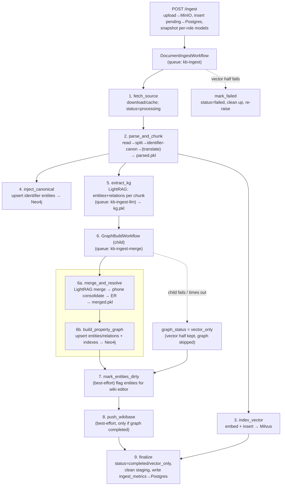
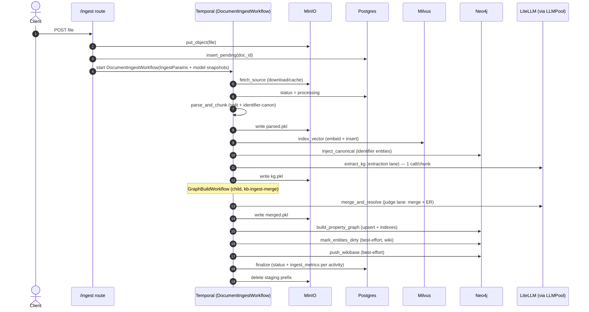

# Конвейер инжеста

Как документ становится доступным для поиска: оркестрируемый Temporal поток инжеста, выполняемые блоки, очереди, на которых они работают, и способ передачи тяжёлого состояния между ними.

> Диаграммы: Mermaid (ниже, редактируется как текст) + отрендеренный обзор D2 в [`diagrams/ingest_flow.svg`](diagrams/ingest_flow.svg) (исходник [`diagrams/ingest_flow.d2`](diagrams/ingest_flow.d2)).
> Справочник по очередям: [`QUEUES.md`](QUEUES.md). Архитектура верхнего уровня: [`ARCHITECTURE.md`](ARCHITECTURE.md).

## Кратко

`POST /ingest` загружает файл в **MinIO**, записывает строку в статусе pending в **Postgres**, делает снимок имён моделей по ролям и запускает долговечный воркфлоу **`DocumentIngestWorkflow`** на очереди `kb-ingest`. Воркфлоу выполняет фиксированную последовательность активностей, передавая тяжёлое состояние (распарсенные ноды, KG-ноды, объединённые сущности) между ними как **MinIO-блобы по URI** (claim-check) — в полезной нагрузке Temporal путешествуют только небольшие контракты. **Векторная половина** (parse → embed → Milvus) и **графовая половина** (extract KG → merge/ER → Neo4j) разделены, так что медленная или упавшая сборка графа деградирует до `graph_status="vector_only"` вместо потери всего инжеста.

## Поток (верхний уровень)

## Последовательность (задействованные хранилища)

## Стадии

| # | Активность | Очередь | Что делает | Вход → Выход | Файл |
|---|---|---|---|---|---|
| 1 | `fetch_source` | kb-ingest | Идемпотентная загрузка из MinIO (кэширует локально); Postgres → `processing` | `IngestParams` → `Ctx` | `activities/fetch_source.py` |
| 2 | `parse_and_chunk` | kb-ingest | Чтение → разбиение (`chunk_size`/`overlap`) → **канонизация идентификаторов** (телефоны→E.164, ИНН/ОГРН…) → опциональный перевод; вычистка метаданных перевода; pickle нод | `Ctx` → `Parsed` (`nodes_uri`) | `activities/parse_and_chunk.py` |
| 3 | `index_vector` | kb-ingest | Срезает метаданные сверх лимита Milvus → embed → вставка в **Milvus**; восстанавливает метаданные на нодах в памяти | `Parsed` → `Indexed` | `activities/index_vector.py` |
| 4 | `inject_canonical` | kb-ingest | Upsert одной `:__Entity__` на каждый `(type, canonical)` идентификатор в **Neo4j** ДО LLM-экстракции (чтобы дословные упоминания от LLM всё равно дедуплицировались) | `Parsed` → `Injected` | `activities/inject_canonical.py` |
| 5 | `extract_kg` | **kb-ingest-llm** | **Экстрактор LightRAG**: один LLM-вызов на чанк → сущности + связи в метаданных чанка; сводит статистику | `Parsed` → `KGExtracted` (`kg.pkl`) | `activities/extract_kg.py` |
| 6a | `merge_and_resolve` | **kb-ingest-merge** | Кросс-чанковое **слияние LightRAG** → **консолидация телефонов** → **ER** (`resolve_entities`: LLM-судья + кэш вердиктов + native-vector kNN/окно) | `KGExtracted` → `Merged` (`merged.pkl`) | `activities/merge_and_resolve.py` |
| 6b | `build_property_graph` | kb-ingest-merge | Срезает небезопасные для Neo4j метаданные → строит PG-индекс (Chunk + `MENTIONS` + сущности/связи) → upsert в **Neo4j** → гарантирует индексы | `Merged` → `GraphBuilt` | `activities/build_property_graph.py` |
| 7 | `mark_entities_dirty` | kb-ingest | Best-effort: помечает имена объединённых сущностей для непрерывного wiki-редактора (Project A) | `MarkDirtyIn` → count | `activities/mark_dirty.py` |
| 8 | `push_wikibase` | kb-ingest | Best-effort (только если граф `completed`): проецирует сущности/связи в локальный якорь Wikibase | `Merged` → `WikibasePushed` | `activities/push_wikibase.py` |
| 9 | `finalize` | kb-ingest | Финальный статус в Postgres; удаление staging-префикса + локальной директории; запись `ingest_metrics` по каждой активности (длительности + теги моделей по ролям) | `FinalizeIn` → `IngestResult` | `activities/finalize.py` |
| — | `mark_failed` | kb-ingest | При падении векторной половины: статус `failed`, очистка, повторный проброс | `MarkFailedIn` | `activities/finalize.py` |

`6a`/`6b` выполняются внутри **дочернего воркфлоу `GraphBuildWorkflow`** (`graph_build.py`), так что медленная LLM-работа по графу имеет свои собственные retry/timeout и метрики и может быть отменена без перезапуска векторной половины.

## Две половины + деградация

- **Векторная половина** (1–3): fetch → parse/chunk → embed → Milvus. Если падает/таймаутится → `mark_failed`, инжест проваливается.
- **Графовая половина** (5–6): extract KG → merge/ER → Neo4j, внутри дочернего воркфлоу. Если поднимается исключение (`ActivityError`/`ChildWorkflowError`) → перехватывается → **`graph_status = "vector_only"`**: документ по-прежнему доступен для векторного поиска, граф просто пропускается. `push_wikibase` тогда тоже пропускается (он завязан на `completed`).

## Claim-check staging (MinIO)

Тяжёлое состояние никогда не путешествует в полезной нагрузке Temporal (лимит 2 МБ) — оно сериализуется в MinIO и передаётся по URI:

| Блоб | Производит | Потребляет |
|---|---|---|
| `{run_id}/parsed.pkl` (list[BaseNode]) | parse_and_chunk | index_vector, inject_canonical, extract_kg |
| `{run_id}/kg.pkl` (nodes + KG metadata) | extract_kg | merge_and_resolve |
| `{run_id}/merged.pkl` (entities, relations, nodes) | merge_and_resolve | build_property_graph, push_wikibase |

`finalize` (или `mark_failed`) удаляет префикс `{run_id}/`; `cleanup_orphans()` подметает блобы упавших прогонов старше 24 ч. (`workflow/staging.py`)

## Очереди, воркеры, конкурентность LLM

Раздельные очереди не дают всплеску LLM заморить голодом работу по записи в Neo4j/слиянию (блокировка головы очереди):

| Очередь | Конкурентность активностей | Что выполняет |
|---|---|---|
| `kb-ingest` | 4 | воркфлоу + IO-активности (fetch, parse, index_vector, inject, mark_dirty, push_wikibase, finalize) |
| `kb-ingest-llm` | 18 | только `extract_kg` |
| `kb-ingest-merge` | 14 | `GraphBuildWorkflow` + merge_and_resolve + build_property_graph |

Поверх покраздельных лимитов Temporal **пер-процессный `LLMPool`** (`retrieval/llm_pool.py`) управляет фактической конкурентностью LLM иерархическими гейтами: потолок **уровня** (small=ёмкость GPU, large=бюджет API) и **полосы по ролям** (extraction/judge/…), захватываемые сначала по полосе, затем глобально по уровню. Так что Temporal может запланировать 18 `extract_kg`, но пул допускает лишь столько одновременных LLM-вызовов, сколько способен обслужить GPU. См. [`QUEUES.md`](QUEUES.md) + [`runbook/multimodel.md`](runbook/multimodel.md).

## Канонизация идентификаторов (детерминированная, до LLM)

24 типа идентификаторов (телефоны→E.164, ИНН/ОГРН с контрольными суммами, email, URL, почтовые адреса через libpostal, даты, суммы, …) извлекаются **детерминированно** в `parse_and_chunk` (без LLM), хранятся в метаданных чанка И дописываются в текст чанка, чтобы LLM видела канонические формы в потоке. Затем `inject_canonical` делает upsert их как нод `:__Entity__` **перед** `extract_kg`, так что даже если LLM извлечёт дословную строку телефона, она дедуплицируется на каноническую ноду. (`ingestion/identifiers.py`, `ingestion/identifier_transform.py`)

## Снимки мультимодели

Имена моделей по ролям (`extraction`/`judge`/`search`) снимаются в момент `POST /ingest` и протягиваются `IngestParams → FinalizeIn`, так что `ingest_metrics` записывает точную модель, выполнявшую каждую активность, даже если модели меняются между сабмитами — пересборка не нужна. (`api/routes/ingest.py`, `activities/finalize.py`; runbook [`runbook/multimodel.md`](runbook/multimodel.md))
