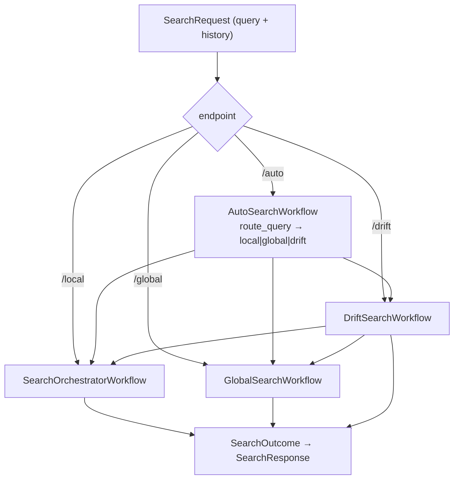
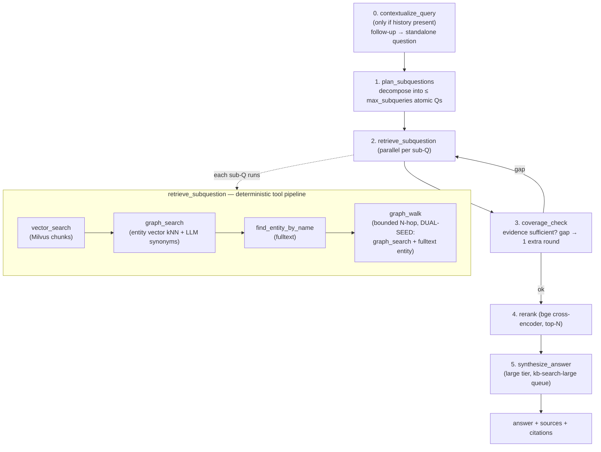
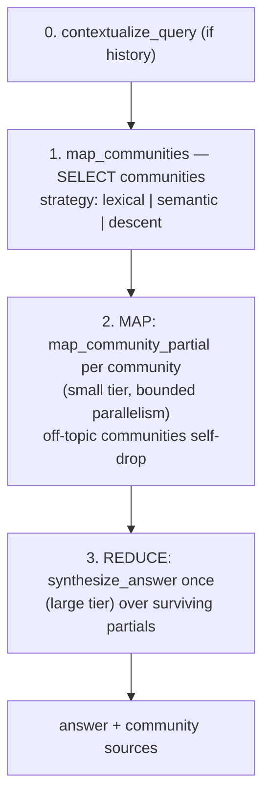
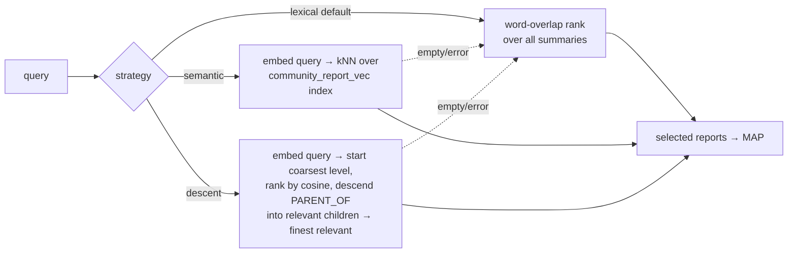
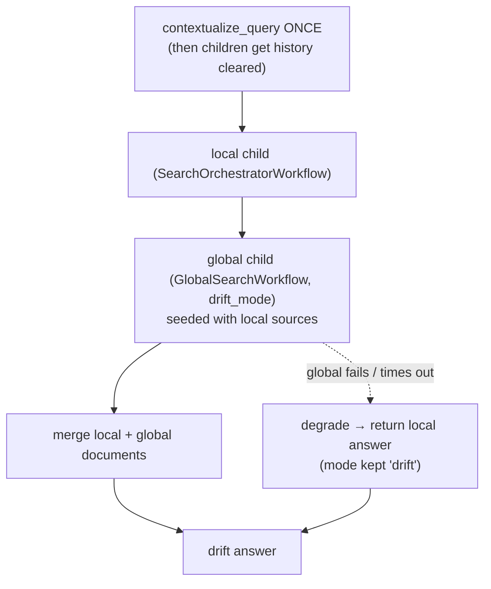

# Поток поиска

Как запрос становится ответом: четыре режима поиска, детерминированный конвейер извлечения, GraphRAG map-reduce по сообществам и как подключаются более новые функции (история диалога, dual walk-seed, откат drift, иерархические сообщества + динамический отбор).

> Диаграммы: Mermaid (ниже) + отрендеренные обзоры D2 — режимы [`diagrams/search_modes.svg`](diagrams/search_modes.svg) (исходник [`diagrams/search_modes.d2`](diagrams/search_modes.d2)), детали локального конвейера [`diagrams/kb_search_flow.svg`](diagrams/kb_search_flow.svg).
> Архитектура подсистемы поиска: [`SEARCH.md`](SEARCH.md). Использование/runbook: [`runbook/search-usage.md`](runbook/search-usage.md).

## Четыре режима

Все четыре являются надёжными воркфлоу Temporal, запускаемыми из `src/api/routes/search_v2.py` и возвращающими один и тот же `SearchOutcome` → `SearchResponse`:

| Эндпоинт | Воркфлоу | Форма | Применение |
|---|---|---|---|
| `POST /search/local` | `SearchOrchestratorWorkflow` | plan → параллельное retrieve → rerank → synthesize | конкретные, заземлённые на сущностях вопросы |
| `POST /search/global` | `GlobalSearchWorkflow` | map-reduce по отчётам сообществ | вопросы уровня корпуса / тематические |
| `POST /search/drift` | `DriftSearchWorkflow` | локальный проход, затем глобальное расширение | исследовательские / многошаговые |
| `POST /search/auto` | `AutoSearchWorkflow` | маршрутизатор классифицирует → диспетчеризует один из вышеперечисленных | пусть система выберет |

## Local — plan-execute (`SearchOrchestratorWorkflow`)

Конвейер извлечения **детерминирован** (это не LLM-цикл ReAct): каждый подвопрос выполняет одну и ту же фиксированную последовательность инструментов, результаты сливаются и дедуплицируются по chunk_id, затем один раз reranked и синтезируются. Сопоставление сущностей в `graph_search` — это **индексированный** нативный векторный kNN Neo4j по эмбеддингам сущностей (масштабируется) плюс шаг LLM-синонимов; `graph_walk` ограничен (≤50 узлов / ≤100 рёбер).

## Global — GraphRAG map-reduce (`GlobalSearchWorkflow`)

**Отбор сообществ** (`map_communities`, задаётся через `AGENT_COMMUNITY_DYNAMIC_SELECTION`):

Сообщества + отчёты строятся **офлайн** через `CommunityBuildWorkflow` на очереди `kb-graph-build` (иерархия Leiden → структурированные отчёты → индекс `report_vec`), отвязанные от горячего пути запроса. См. [Иерархические сообщества](#иерархические-сообщества--динамический-отбор) ниже.

## Drift — сначала local, потом global

Drift контекстуализирует follow-up **один раз** и передаёт переписанный запрос обоим детям (история очищена, чтобы они не перезапускали это). Если глобальный проход падает, запрос **деградирует до локального ответа** вместо падения.

## Инструменты извлечения

| Инструмент | Бэкенд | Что возвращает | Примечания |
|---|---|---|---|
| `vector_search` | Milvus (HNSW) | top-k чанков по сходству эмбеддингов | плотный baseline |
| `graph_search` | Neo4j нативный векторный индекс по эмбеддингам сущностей + `LLMSynonymRetriever` | найденные сущности + их соседи + связанные чанки | индексированный kNN (масштабируется); один вызов small-LLM для синонимов |
| `find_entity_by_name` | Neo4j полнотекстовый индекс по `__Entity__.name` | сущности по (частичному) имени | ловит опечатки / частичные имена |
| `graph_walk` | Neo4j переменной длины `(e)-[*1..hops]-` | ограниченная окрестность (≤50 узлов/≤100 рёбер) | **с двойным засевом** из топовой сущности graph_search И полнотекста |

## Новые функции в потоке

### История диалога (многоходовая)
`SearchRequest.history` (управляемая клиентом) → активность `contextualize_query` переписывает follow-up в самостоятельный вопрос **один раз в начале** каждого воркфлоу (только когда история непуста), через `params.model_copy(query=…)`, так что весь нижестоящий конвейер использует его. Opt-in (`AGENT_CONVERSATION_HISTORY_ENABLED`, по умолчанию вкл, но инертна без истории); решение о включении разрешается при запуске (`contextualize_enabled` на params), чтобы оставаться безопасным к replay. Drift контекстуализирует один раз и очищает историю детей. (`activities/contextualize.py`, [`FEATURES.md`](FEATURES.md#conversation-history))

### Dual walk-seed
`graph_walk` теперь засевается из **обеих** — топовой сущности `graph_search` и топовой сущности `find_entity_by_name` — когда они различаются, так что сущность, найденная полнотекстом (частичное имя / опечатка), всё равно вносит свою окрестность, даже когда `graph_search` уже что-то вернул. Конфиг `AGENT_GRAPH_WALK_DUAL_SEED` (по умолчанию вкл). (`activities/retrieve.py::_walk_seeds`)

### Иерархические сообщества + динамический отбор
Заменяет плоские сообщества уровня 0 + O(N) лексическое ранжирование на Leiden-**иерархию** (многоуровневые `:Community` + `PARENT_OF`), **структурированные отчёты** (`{title, summary, findings}`, построенные снизу вверх, эмбеддированные в индекс `community_report_vec`, переносимые инкрементально, когда состав сообщества не изменился) и **динамический отбор** (семантический kNN или спуск по иерархии) для global/drift. Всё opt-in: `AGENT_COMMUNITY_MAX_LEVELS` (по умолчанию 1 = один уровень, сегодня), `AGENT_COMMUNITY_DYNAMIC_SELECTION` (по умолчанию `lexical` = сегодня). Полная детализация в [`FEATURES.md`](FEATURES.md#hierarchical-communities--dynamic-selection).

### Reranker + проверка покрытия
Каждое слияние извлечения local/drift проходит rerank через **bge cross-encoder** (top-N → синтез), а **проверка покрытия** может обнаружить пробел в доказательствах и запустить один дополнительный целевой раунд извлечения перед синтезом — обе функции уже существовали, по умолчанию включены.
