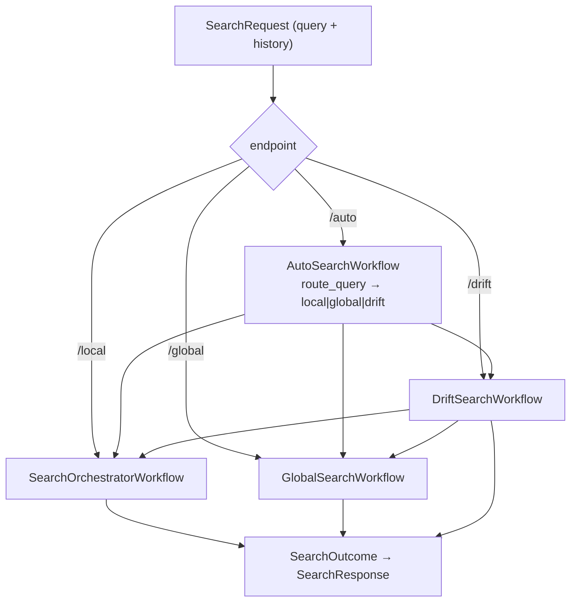
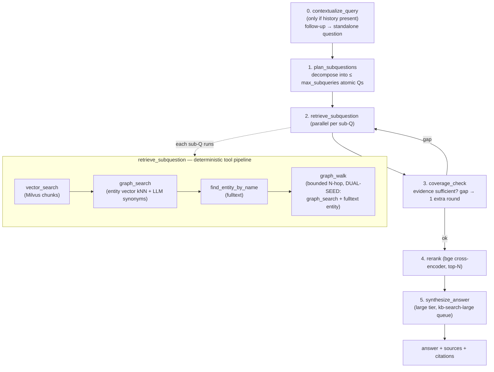
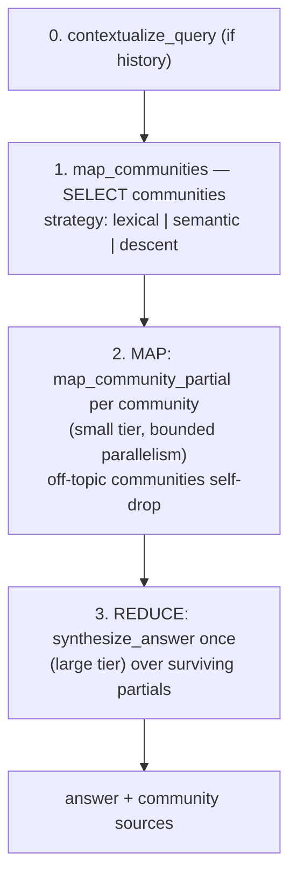
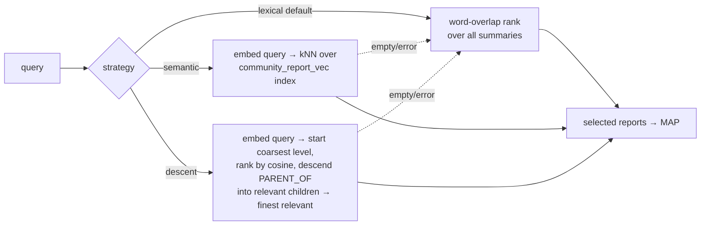
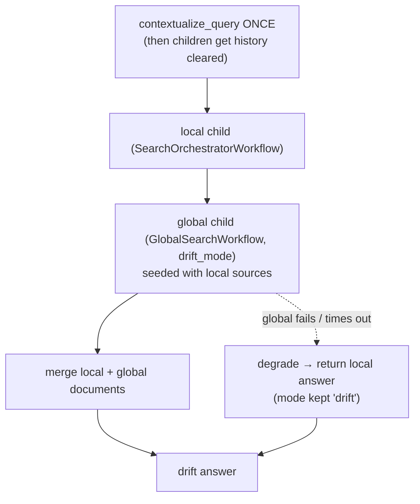

# Search flow

How a query becomes an answer: the four search modes, the deterministic retrieval pipeline, the GraphRAG community map-reduce, and how the newer features (conversation history, dual walk-seed, drift fallback, hierarchical communities + dynamic selection) plug in.

> Diagrams: Mermaid (below) + rendered D2 overviews — modes [`diagrams/search_modes.svg`](diagrams/search_modes.svg) (source [`diagrams/search_modes.d2`](diagrams/search_modes.d2)), local pipeline detail [`diagrams/kb_search_flow.svg`](diagrams/kb_search_flow.svg).
> Architecture of the search subsystem: [`SEARCH.md`](SEARCH.md). Usage/runbook: [`runbook/search-usage.md`](runbook/search-usage.md).

## Four modes

All four are durable Temporal workflows submitted from `src/api/routes/search_v2.py`, returning the same `SearchOutcome` → `SearchResponse`:

| Endpoint | Workflow | Shape | Use |
|---|---|---|---|
| `POST /search/local` | `SearchOrchestratorWorkflow` | plan → parallel retrieve → rerank → synthesize | specific, entity-grounded questions |
| `POST /search/global` | `GlobalSearchWorkflow` | map-reduce over community reports | corpus-level / thematic questions |
| `POST /search/drift` | `DriftSearchWorkflow` | local pass, then global expansion | exploratory / multi-hop |
| `POST /search/auto` | `AutoSearchWorkflow` | router classifies → dispatch one of the above | let the system pick |

## Local — plan-execute (`SearchOrchestratorWorkflow`)

The retrieval pipeline is **deterministic** (not an LLM ReAct loop): every sub-question runs the same fixed tool sequence, results are merged + deduped by chunk_id, then reranked and synthesized once. `graph_search`'s entity matching is an **indexed** native Neo4j vector kNN over entity embeddings (scales) plus an LLM synonym step; `graph_walk` is bounded (≤50 nodes / ≤100 edges).

## Global — GraphRAG map-reduce (`GlobalSearchWorkflow`)

**Community selection** (`map_communities`, set by `AGENT_COMMUNITY_DYNAMIC_SELECTION`):

Communities + reports are built **offline** by `CommunityBuildWorkflow` on the `kb-graph-build` queue (Leiden hierarchy → structured reports → `report_vec` index), decoupled from the query hot path. See [Hierarchical communities](#hierarchical-communities--dynamic-selection) below.

## Drift — local then global

Drift contextualises the follow-up **once** and passes the rewritten query to both children (history cleared so they don't re-run it). If the global pass fails, the request **degrades to the local answer** rather than failing.

## The retrieval tools

| Tool | Backend | What it returns | Notes |
|---|---|---|---|
| `vector_search` | Milvus (HNSW) | top-k chunks by embedding similarity | the dense baseline |
| `graph_search` | Neo4j native vector index over entity embeddings + `LLMSynonymRetriever` | matched entities + their neighbours + related chunks | indexed kNN (scales); one small-LLM synonym call |
| `find_entity_by_name` | Neo4j fulltext index on `__Entity__.name` | entities by (partial) name | catches typos / partial names |
| `graph_walk` | Neo4j variable-length `(e)-[*1..hops]-` | bounded neighbourhood (≤50 nodes/≤100 edges) | **dual-seeded** from the top graph_search AND fulltext entity |

## New features in the flow

### Conversation history (multi-turn)
`SearchRequest.history` (client-managed) → a `contextualize_query` activity rewrites the follow-up into a standalone question **once at the start** of each workflow (only when history is non-empty), via `params.model_copy(query=…)` so the whole downstream pipeline uses it. Opt-in (`AGENT_CONVERSATION_HISTORY_ENABLED`, default on but inert without history); the gate is resolved at submit time (`contextualize_enabled` on the params) to stay replay-safe. Drift contextualises once and clears children history. (`activities/contextualize.py`, [`FEATURES.md`](FEATURES.md#conversation-history))

### Dual walk-seed
`graph_walk` is now seeded from **both** the top `graph_search` entity and the top `find_entity_by_name` entity when they differ — so a fulltext-matched entity (partial name / typo) still contributes its neighbourhood even when `graph_search` already returned something. Config `AGENT_GRAPH_WALK_DUAL_SEED` (default on). (`activities/retrieve.py::_walk_seeds`)

### Hierarchical communities + dynamic selection
Replaces flat level-0 communities + O(N) lexical ranking with a Leiden **hierarchy** (multi-level `:Community` + `PARENT_OF`), **structured reports** (`{title, summary, findings}`, built bottom-up, embedded into a `community_report_vec` index, carried over incrementally when a community's member set is unchanged), and **dynamic selection** (semantic kNN or hierarchy descent) for global/drift. All opt-in: `AGENT_COMMUNITY_MAX_LEVELS` (default 1 = single-level, today), `AGENT_COMMUNITY_DYNAMIC_SELECTION` (default `lexical` = today). Full detail in [`FEATURES.md`](FEATURES.md#hierarchical-communities--dynamic-selection).

### Reranker + coverage check
Every local/drift retrieval merge is reranked by a **bge cross-encoder** (top-N → synthesis), and a **coverage check** can detect an evidence gap and run one extra targeted retrieval round before synthesis — both pre-existing, on by default.
